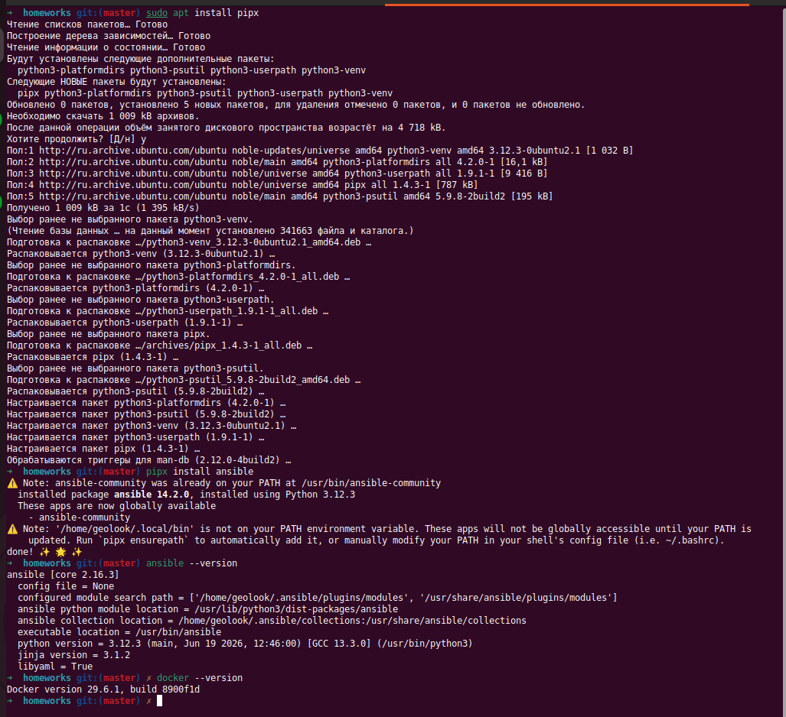
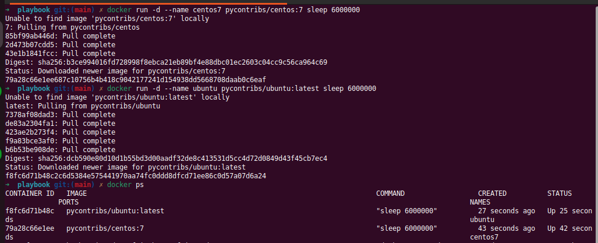
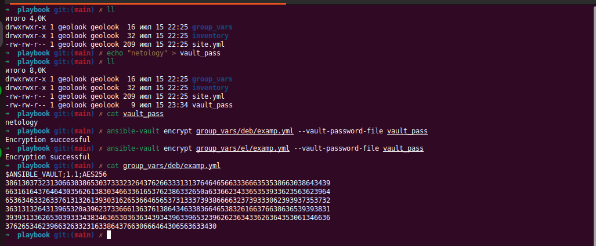
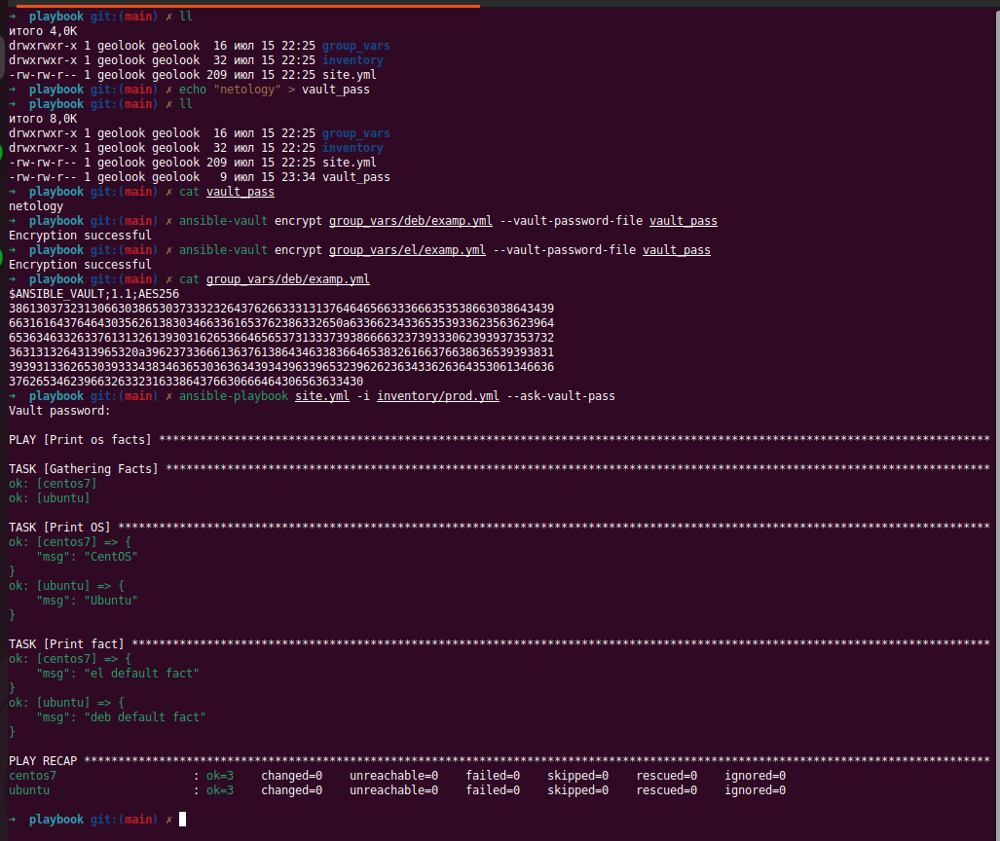
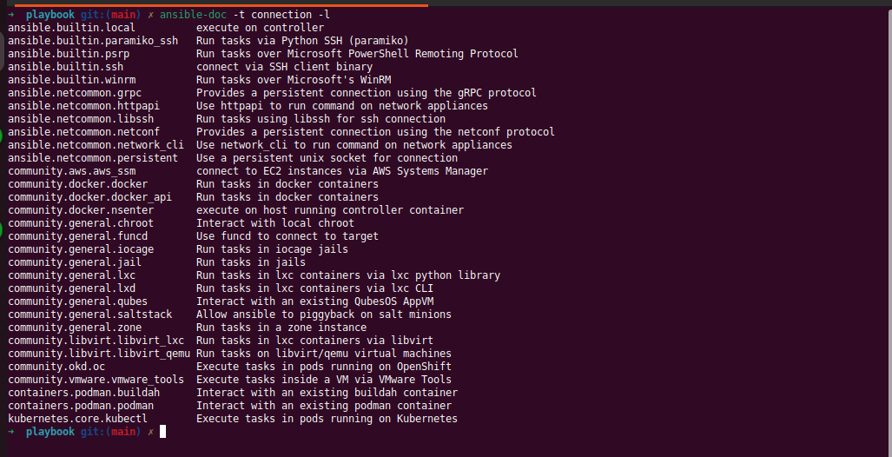
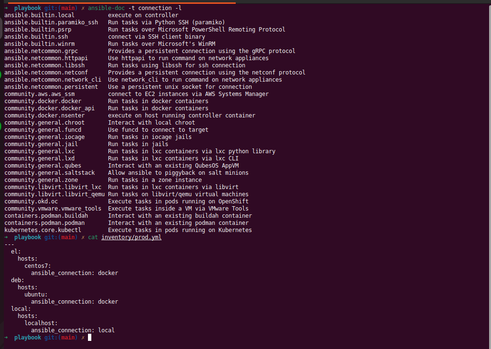
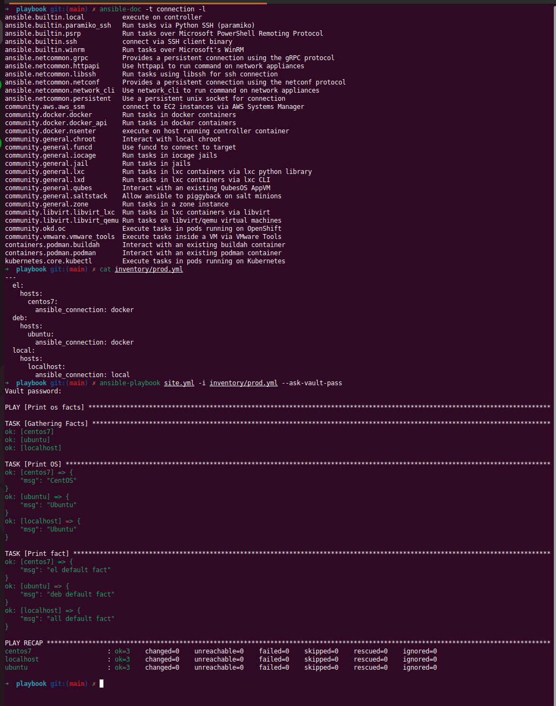

# Выполнение вводного домашнего задания

## 0. Подготовка окружения

```sh
sudo apt update && sudo apt install -y python3 python3-pip pipx
pipx install ansible
```



---

## 1. Попробуйте запустить playbook на окружении из test.yml, зафиксируйте значение, которое имеет факт some_fact для указанного хоста при выполнении playbook.

```sh
ansible-playbook site.yml -i inventory/test.yml
```


Значение `some_fact` = 12

---

## 2. Найдите файл с переменными (group_vars), в котором задаётся найденное в первом пункте значение, и поменяйте его на all default fact.


---

## 3. Воспользуйтесь подготовленным (используется docker) или создайте собственное окружение для проведения дальнейших испытаний.



---

## 4. Проведите запуск playbook на окружении из prod.yml. Зафиксируйте полученные значения some_fact для каждого из managed host.


Значение `some_fact`
- `centos7` = `el`
- `ubuntu` = `deb`

---

## 5. Добавьте факты в group_vars каждой из групп хостов так, чтобы для some_fact получились значения: для deb — deb default fact, для el — el default fact.
## 6. Повторите запуск playbook на окружении prod.yml. Убедитесь, что выдаются корректные значения для всех хостов.


Значение `some_fact`
- `centos7` = `el default fact`
- `ubuntu` = `deb default fact`

---

## 7. При помощи ansible-vault зашифруйте факты в group_vars/deb и group_vars/el с паролем netology.

```sh
echo "netology" > vault_pass
ansible-vault encrypt group_vars/deb/examp.yml --vault-password-file vault_pass
ansible-vault encrypt group_vars/el/examp.yml --vault-password-file vault_pass
```



---

## 8. Запустите playbook на окружении prod.yml. При запуске ansible должен запросить у вас пароль. Убедитесь в работоспособности.

```sh
ansible-playbook site.yml -i inventory/prod.yml --ask-vault-pass
```



---

## 9. Посмотрите при помощи ansible-doc список плагинов для подключения. Выберите подходящий для работы на control node.

```sh
ansible-doc -t connection -l
```



---

## 10. В prod.yml добавьте новую группу хостов с именем local, в ней разместите localhost с необходимым типом подключения.



---

## 11. Запустите playbook на окружении prod.yml. При запуске ansible должен запросить у вас пароль. Убедитесь, что факты some_fact для каждого из хостов определены из верных group_vars.



Значение `some_fact`
- `centos7` = `el default fact`
- `ubuntu` = `deb default fact`
- `localhost` = `all default fact`

---

## 12. Заполнение README.md ответами на вопросы публикация в GIT.


