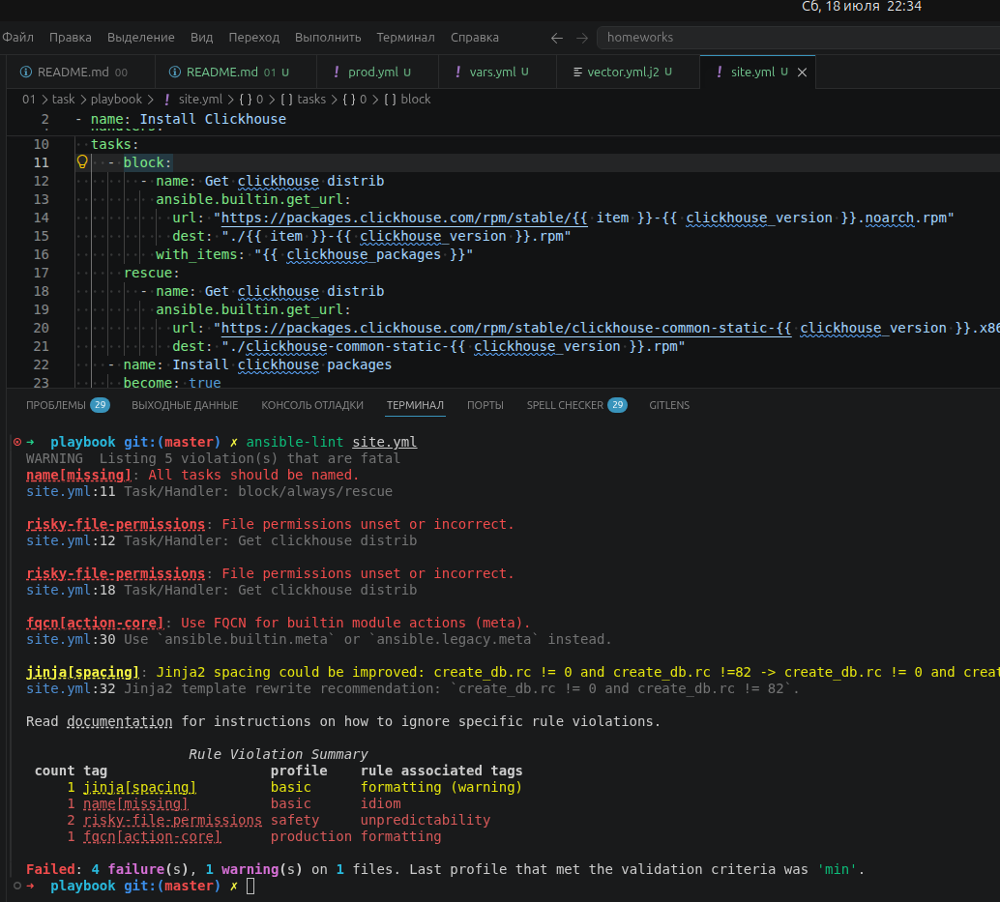
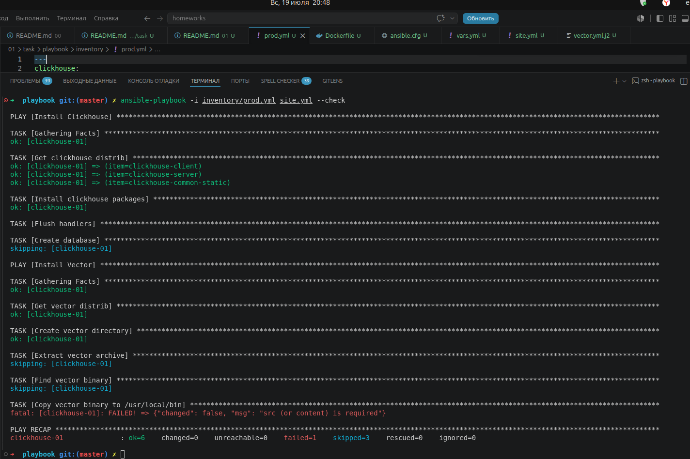
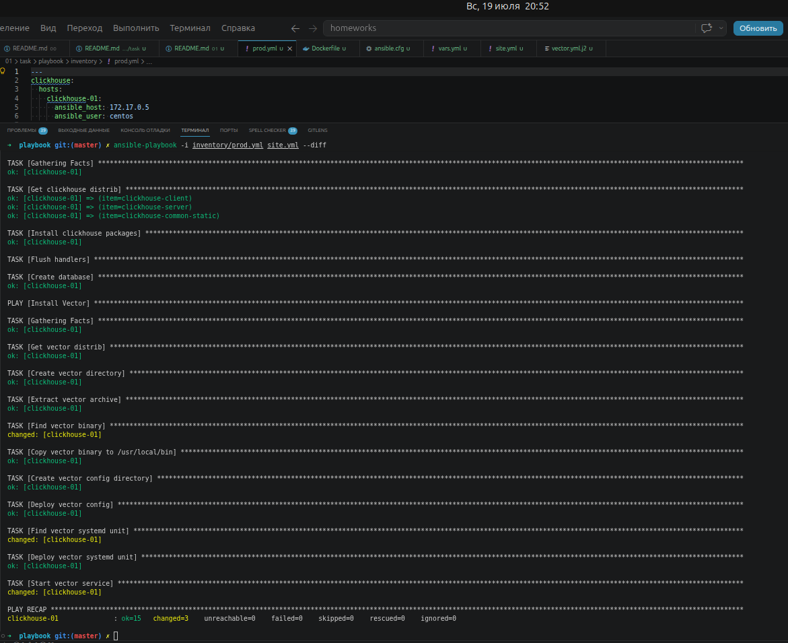
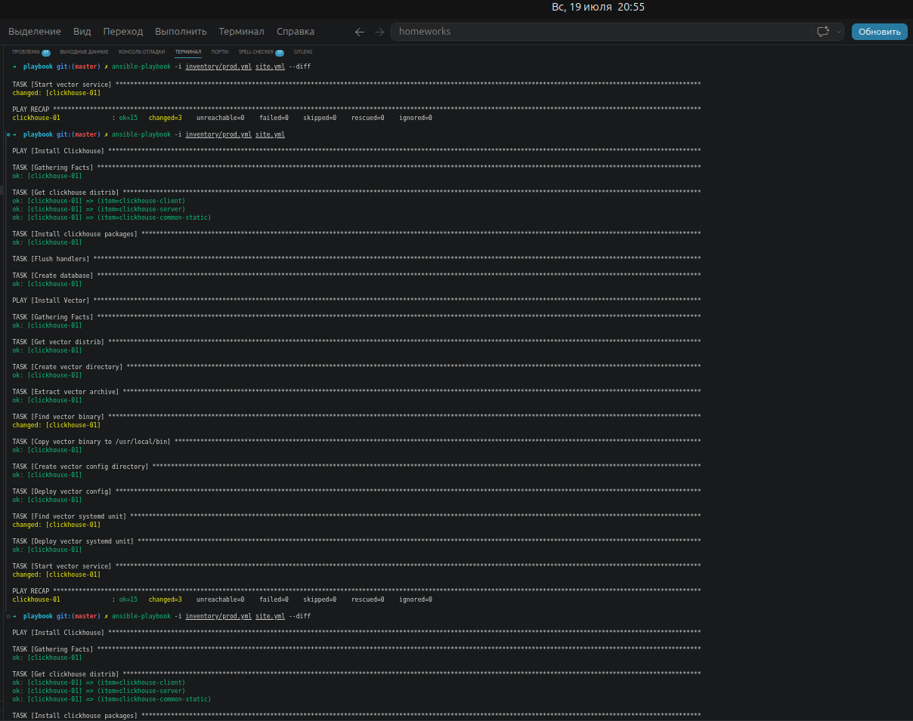
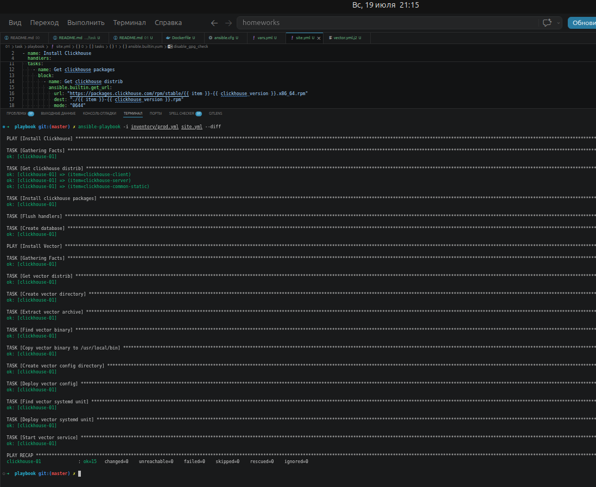

# Выполнение второго вводного домашнего задания

## 0. Подготовка окружения

```sh
sudo apt install ansible-lint
```

## 1. Подготовил свой  inventory-файл `prod.yml`.

## 2. Расшил playbook `vars.yml`, `site.yml` и исправил ошибки, создал `vector.yml.j2`.



## 3. При создании tasks использованы модули: `get_url`, `template`, `unarchive`, `file`.

## 4. Playbook скачивает архив Vector, распаковывает его в `/opt/vector`, копирует бинарник в `/usr/local/bin/vector`, создаёт конфигурацию из шаблона и запускает сервис.

## 5. Ошибки исправлены на пункте 2.

## 6. Проверка, сравнение, применение и повторная проверка








