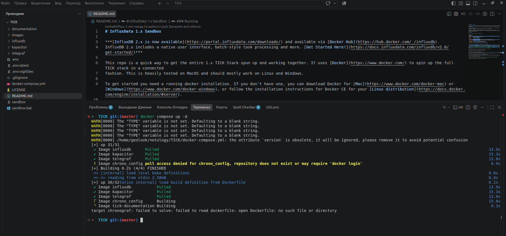
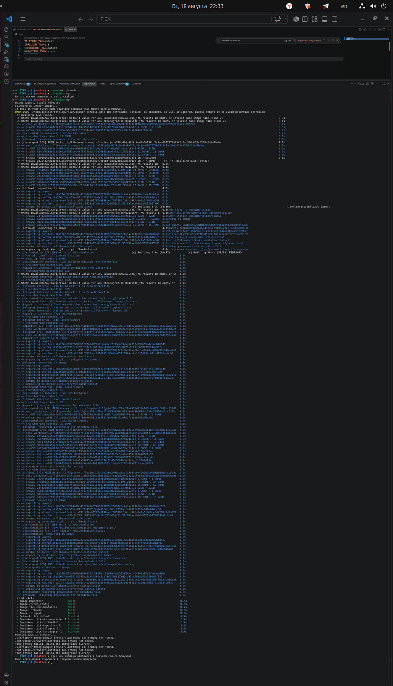
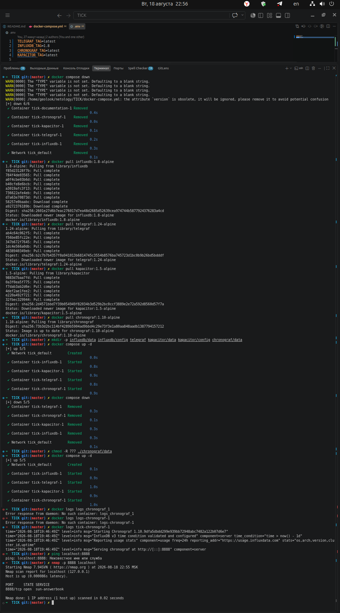
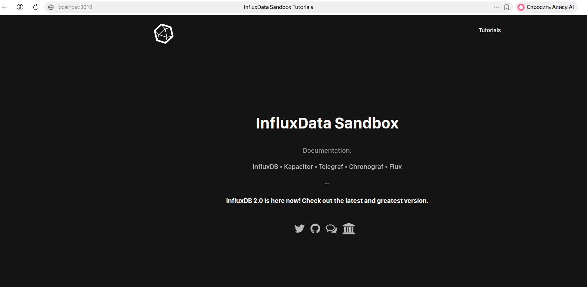
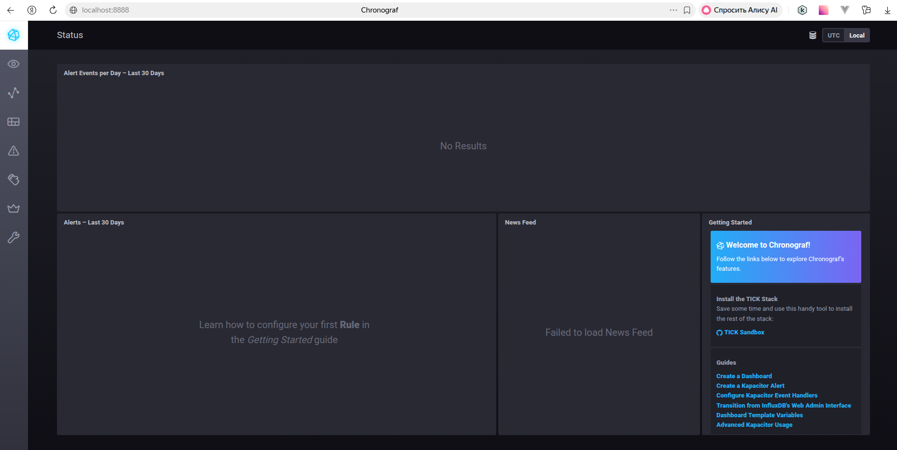
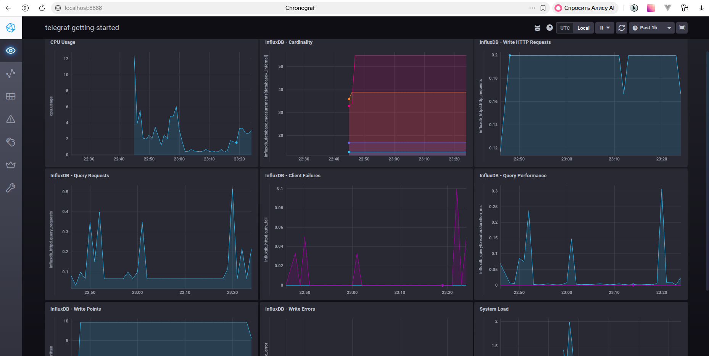
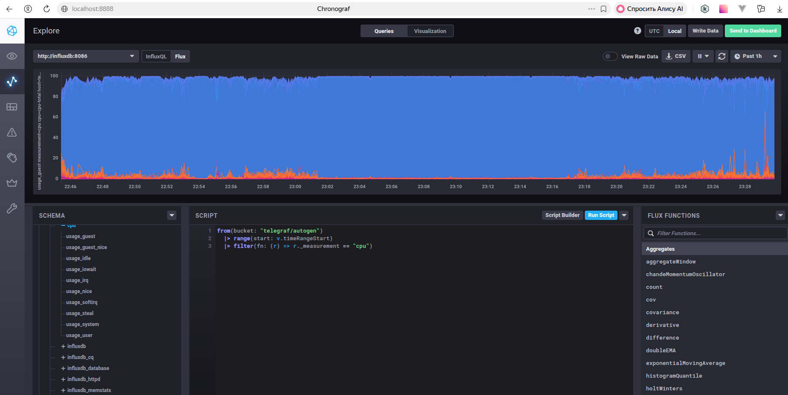
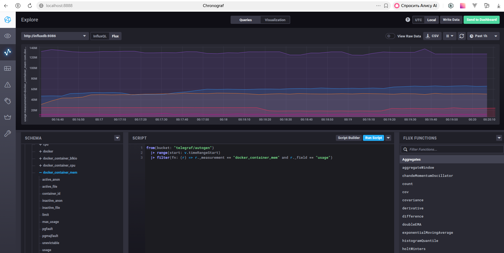

# Домашнее задание к занятию "13.Системы мониторинга"

---
---

## Обязательные задания

1. Вас пригласили настроить мониторинг на проект. На онбординге вам рассказали, что проект представляет из себя платформу для вычислений с выдачей текстовых отчетов, которые сохраняются на диск. Взаимодействие с платформой осуществляется по протоколу http. Также вам отметили, что вычисления загружают ЦПУ. Какой минимальный набор метрик вы выведите в мониторинг и почему?

    Требуются метрики следующих групп:  
    - Аппаратные: CPU, RAM, Disk, Inodes.
    - Сетевые/прикладные: HTTP-коды, время ответа, число запросов.
    - Бизнес-метрики: количество сгенерированных отчётов.
    - Статистика для разработчиков: ошибки в логах.

    Примерный набор метрик:  
    - CPU load average - средняя нагрузка на процессор за 1/5/15 минут для понимания загруженности ЦПУ
    - RAM usage - использование памяти, чтобы не допустить исчерпания памяти.
    - Disk free - место на диске для отчётов.
    - inodes free - свободные индексные регистры (могут исчерпаться, даже если есть место).
    - HTTP 2xx/4xx/5xx rate - оценка доступности сервиса.
    - Request  latency - среднее время ответов на запросы. Показывает доступность системы пользователям.
    - Report count - количество сгенерированных отчётов.
    - Error log count - количество ошибок, для быстрого обнаружения внутренних ошибок.

---

2. Менеджер продукта посмотрев на ваши метрики сказал, что ему непонятно что такое RAM/inodes/CPUla. Также он сказал, что хочет понимать, насколько мы выполняем свои обязанности перед клиентами и какое качество обслуживания. Что вы можете ему предложить?

    - RAM - оперативная память: сколько памяти использует приложение; если закончится, сервис может упасть.
    - Inodes - количество "записей о файлах" в файловой системе. Даже если место на диске есть, могут закончиться inodes, и новые файлы создаваться не будут.
    - CPUla - средняя нагрузка на процессор за 1/5/15 минут. Показывает, сколько задач ждут ЦПУ.

    Бизнес метрики:
    - Процент успеха - отношение успешных (200) запросов к общему количеству запросов (процент выполненных отчётов).
    - Задержка 95/99 - время ответа для 95% и 99% запросов. Показывает, как быстро клиенты получают отчёты.
    - Доступность (% работы) - процент времени, когда сервис отвечал на запросы (или не возвращал 5xx).

---

3. Вашей DevOps команде в этом году не выделили финансирование на построение системы сбора логов. Разработчики в свою очередь хотят видеть все ошибки, которые выдают их приложения. Какое решение вы можете предпринять в этой ситуации, чтобы разработчики получали ошибки приложения?

    - Настроить приложение на вывод ошибок в системный логгер (rsyslog) или отдельный лог-файл (с ротацией силами приложения).
    - Написать cron-скрипт, который раз в час ищет новые ошибки и отправляет их разработчикам по почте.
  
    * **Плюсы**: не требует внешних систем, легко реализовать.  
    * **Минусы**: нет централизации, трудно искать по истории.  

---

4. Вы, как опытный SRE, сделали мониторинг, куда вывели отображения выполнения SLA=99% по http кодам ответов. Вычисляете этот параметр по следующей формуле: summ_2xx_requests/summ_all_requests. Данный параметр не поднимается выше 70%, но при этом в вашей системе нет кодов ответа 5xx и 4xx. Где у вас ошибка?

    - Проверить, что в summ_all_requests входят все ответы, включая 3xx и, возможно, не-HTTP ответы (например, статические файлы).
    - Если в системе нет 4xx/5xx, но показатель 70% - значит, остальные 30% - это редиректы (3xx), которые не учитываются как успешные в формуле.
    - Скорректировать формулу в зависимости от требований бизнеса/разработки:
      - считать успехом 2xx и 3xx (если они допустимы).
      - исключить 3xx из знаменателя (считать только запросы, которые должны возвращать 2xx).

---

5. Опишите основные плюсы и минусы pull и push систем мониторинга.

    - Pull (сервер забирает метрики):
      - Плюсы:
        - единая точка управления сбором;
        - контроль списка узлов для сбора данных и подлинности данных;
        - простота обнаружения отказавших агентов;
        - можно настроить единый прокси к агентам с TLS.
      - Минусы:
        - нужно открывать порты;
        - не подходит для краткосрочных задач.
    - Push (агенты отправляют метрики):
      - Плюсы:
        - упрощённая репликация данных в разные системы мониторинга и их резервные копии;
        - гибкая настройка отправки пакетов данных с метриками;
        - может работать быстрее при использовании UPD.
      - Минусы: 
        - требуется агент/клиент на каждом хосте;
        - доставка не гарантируется;
        - возможна перегрузка коллектора.

---

6. Какие из ниже перечисленных систем относятся к push модели, а какие к pull? А может есть гибридные?

    - Prometheus - pull (основной режим, умеет принимать push через Pushgateway)
    - TICK - push
    - Zabbix - гибридная: агенты могут отправлять данные (push), а сервер может опрашивать (pull)
    - VictoriaMetrics - pull (совместима с Prometheus scrape)
    - Nagios - pull (сервер опрашивает)

---

7. Склонируйте себе [репозиторий](https://github.com/influxdata/sandbox/tree/master) и запустите TICK-стэк, используя технологии docker и docker-compose.

В виде решения на это упражнение приведите скриншот веб-интерфейса ПО chronograf (`http://localhost:8888`). 

P.S.: если при запуске некоторые контейнеры будут падать с ошибкой - проставьте им режим `Z`, например
`./data:/var/lib:Z`

  
  
  
  
  

---

8. Перейдите в веб-интерфейс Chronograf (http://localhost:8888) и откройте вкладку Data explorer.
        
    - Нажмите на кнопку Add a query
    - Изучите вывод интерфейса и выберите БД telegraf.autogen
    - В `measurments` выберите cpu->host->telegraf-getting-started, а в `fields` выберите usage_system. Внизу появится график утилизации cpu.
    - Вверху вы можете увидеть запрос, аналогичный SQL-синтаксису. Поэкспериментируйте с запросом, попробуйте изменить группировку и интервал наблюдений.

Для выполнения задания приведите скриншот с отображением метрик утилизации cpu из веб-интерфейса.

  
  
  

---

9. Изучите список [telegraf inputs](https://github.com/influxdata/telegraf/tree/master/plugins/inputs). 
Добавьте в конфигурацию telegraf следующий плагин - [docker](https://github.com/influxdata/telegraf/tree/master/plugins/inputs/docker):
```
[[inputs.docker]]
  endpoint = "unix:///var/run/docker.sock"
```

Дополнительно вам может потребоваться донастройка контейнера telegraf в `docker-compose.yml` дополнительного volume и 
режима privileged:
```
  telegraf:
    image: telegraf:1.4.0
    privileged: true
    volumes:
      - ./etc/telegraf.conf:/etc/telegraf/telegraf.conf:Z
      - /var/run/docker.sock:/var/run/docker.sock:Z
    links:
      - influxdb
    ports:
      - "8092:8092/udp"
      - "8094:8094"
      - "8125:8125/udp"
```

После настройке перезапустите telegraf, обновите веб интерфейс и приведите скриншотом список `measurments` в веб-интерфейсе базы telegraf.autogen . Там должны появиться метрики, связанные с docker.

Факультативно можете изучить какие метрики собирает telegraf после выполнения данного задания.

  
Доработаны:  
- **sandbox** - заменён `docker-compose` на `docker compose`
- **docker-compose.yml** - перенастроен с сохранением всех контейнеров, но образы и их настройки актуализированы
- **.env** - изменены значения
- **telegraf/telegraf.conf** - эксперименты с `inputs.docker`

---
---

Дополнительное задание не выполнял - долго провозился с основными из-за старых образов и не совместимости с docker.

## Дополнительное задание (со звездочкой*) - необязательно к выполнению

1. Вы устроились на работу в стартап. На данный момент у вас нет возможности развернуть полноценную систему мониторинга, и вы решили самостоятельно написать простой python3-скрипт для сбора основных метрик сервера. Вы, как опытный системный-администратор, знаете, что системная информация сервера лежит в директории `/proc`. Также, вы знаете, что в системе Linux есть  планировщик задач cron, который может запускать задачи по расписанию.

Суммировав все, вы спроектировали приложение, которое:
- является python3 скриптом
- собирает метрики из папки `/proc`
- складывает метрики в файл 'YY-MM-DD-awesome-monitoring.log' в директорию /var/log 
(YY - год, MM - месяц, DD - день)
- каждый сбор метрик складывается в виде json-строки, в виде:
  + timestamp (временная метка, int, unixtimestamp)
  + metric_1 (метрика 1)
  + metric_2 (метрика 2)
  
     ...
     
  + metric_N (метрика N)
  
- сбор метрик происходит каждую 1 минуту по cron-расписанию

Для успешного выполнения задания нужно привести:

а) работающий код python3-скрипта,

б) конфигурацию cron-расписания,

в) пример верно сформированного 'YY-MM-DD-awesome-monitoring.log', имеющий не менее 5 записей,

P.S.: количество собираемых метрик должно быть не менее 4-х.
P.P.S.: по желанию можно себя не ограничивать только сбором метрик из `/proc`.

2. В веб-интерфейсе откройте вкладку `Dashboards`. Попробуйте создать свой dashboard с отображением:

    - утилизации ЦПУ
    - количества использованного RAM
    - утилизации пространства на дисках
    - количество поднятых контейнеров
    - аптайм
    - ...
    - фантазируйте)
    
    ---

### Как оформить ДЗ?

Выполненное домашнее задание пришлите ссылкой на .md-файл в вашем репозитории.

---
