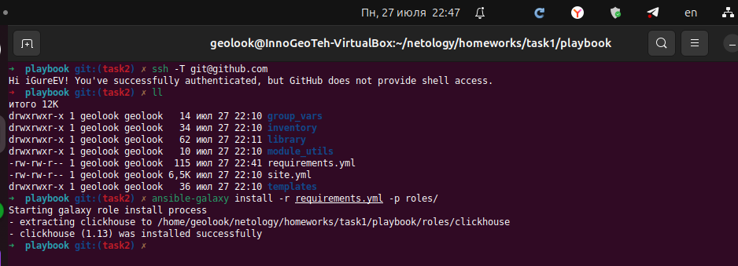
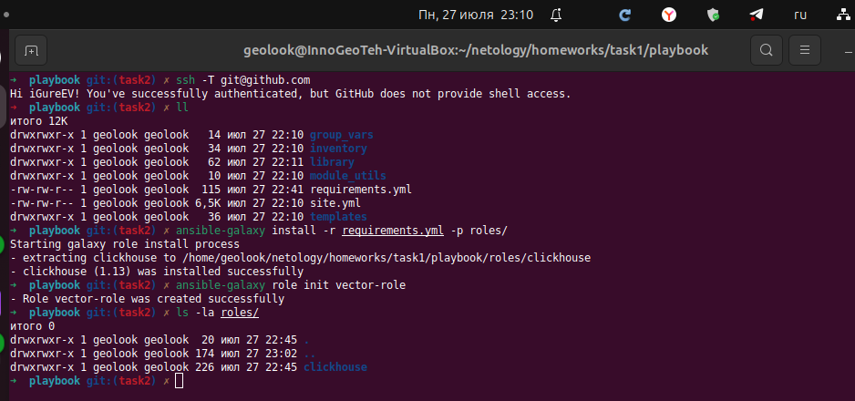
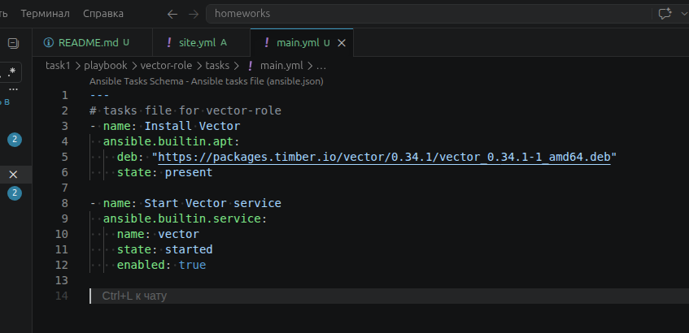
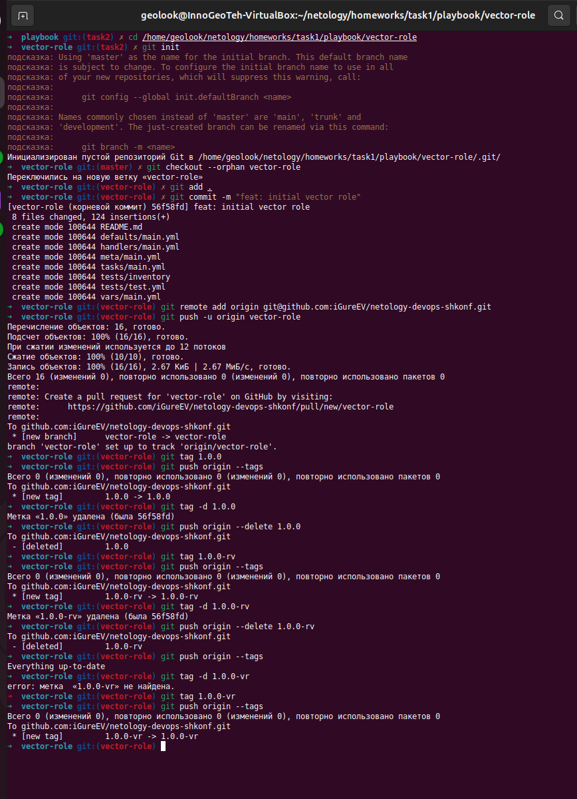
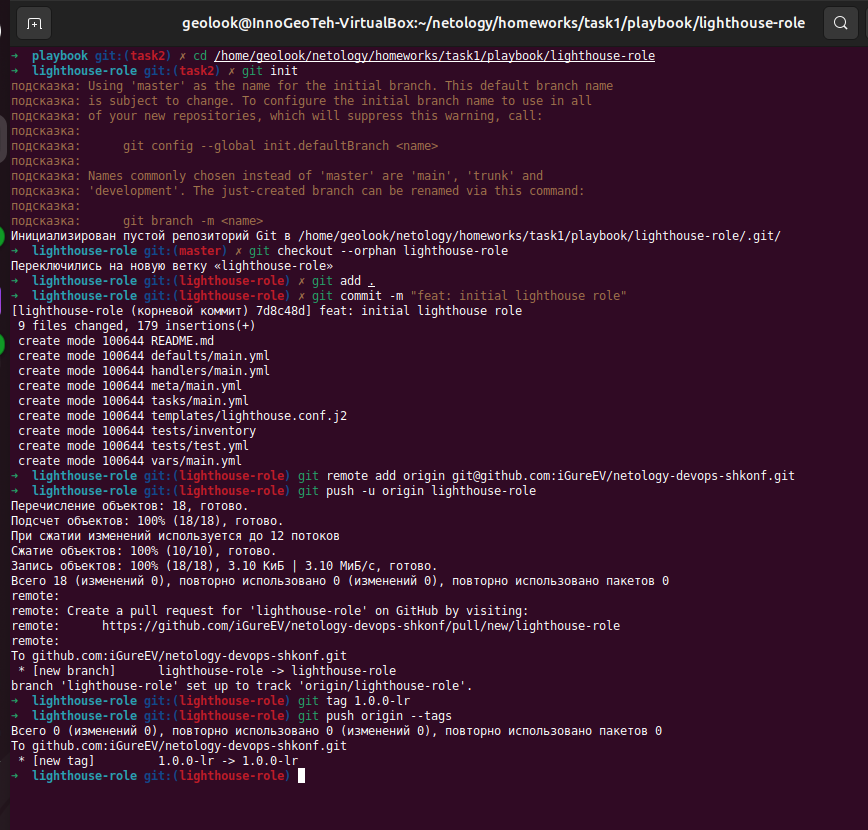
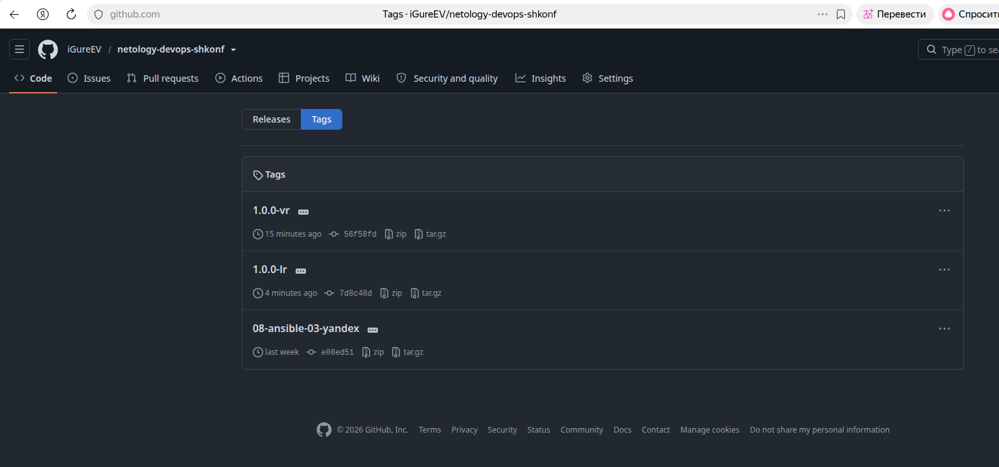
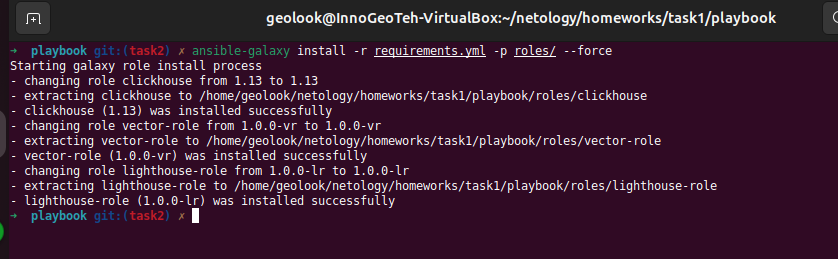

# Домашнее задание к занятию 4 «Работа с roles»

---
---

## Подготовка к выполнению

1. * Необязательно. Познакомьтесь с [LightHouse](https://youtu.be/ymlrNlaHzIY?t=929).
2. Создайте два пустых публичных репозитория в любом своём проекте: vector-role и lighthouse-role.
3. Добавьте публичную часть своего ключа к своему профилю на GitHub.

---

0. Ютуб в настоящее время недоступен - ознакомиться не удалось.
1. Создание SSH ключа для Git::

```sh
ssh-keygen -t rsa -b 4096 -C "my_email@domain.ru"
cat ~/.ssh/id_rsa.pub
```

2. Настройки колючей: https://github.com/settings/keys
3. Новый ключ добавляется по кнопке "New SSH key".
4. Поле Title - произвольное название ключа (например, "My VM").
5. Поле Key - ключ выведенный `cat ~/.ssh/id_rsa.pub` на пункте 1.
6. По кнопке "Add SSH key" ключ добавляется в список ключей.
7. Проверка ключа:

```sh
ssh -T git@github.com
```



---
---

## Основная часть

Цель — разбить ваш playbook на отдельные roles. 

Задача — сделать roles для ClickHouse, Vector и LightHouse и написать playbook для использования этих ролей. 

Ожидаемый результат — существуют три ваших репозитория: два с roles и один с playbook.

**PS**  

Логика простановки тэгов не особо понятна, ли созданы ветки в репозитории вместо отдельных репозиториев.

**Что нужно сделать**

1. Создайте в старой версии playbook файл `requirements.yml` и заполните его содержимым:

   ```yaml
   ---
     - src: git@github.com:AlexeySetevoi/ansible-clickhouse.git
       scm: git
       version: "1.13"
       name: clickhouse 
   ```

2. При помощи `ansible-galaxy` скачайте себе эту роль.


3. Создать новый каталог с ролью при помощи `ansible-galaxy role init vector-role`.



4. На основе tasks из старого playbook заполнить новую role. Разнести переменные между `vars` и `default`.

  

Для `Vector` не создавались переменны которые можно было бы разнести, но в `default` созданы примеры переменных.

5. Перенести нужные шаблоны конфигов в `templates`.

Шаблонов для `Vector` в прошлом задании не создавалось, только для `LightHouse`.

6. Описать в `README.md` обе роли и их параметры. Пример качественной документации ansible role [по ссылке](https://github.com/cloudalchemy/ansible-prometheus).
7. Повтор шаги 3–6 для LightHouse. Замечание: одна роль должна настраивать один продукт.

Повторил шаги 3-6.  
В итоге получил 2 дополнительных каталога в `playbook` - `vector-role` и `lighthouse-role`.

8. Выложить все roles в репозитории. Проставить теги, используя семантическую нумерацию. Добавить roles в `requirements.yml` в playbook.

Выложил роли в разные ветки репозитория и проставил им тэги.  
  
> **Примечание:** Теги в Git глобальны для всего репозитория. Нельзя создать два тега с одинаковым именем, даже в разных ветках. Поэтому используется постфикс: `1.0.0-vr` и `1.0.0-lr`.  
  
  
  
  
  
  
  
Проверка скачивания всех ролей:
  

9. Переработать playbook на использование roles. Не забыть про зависимости LightHouse и возможности совмещения `roles` с `tasks`.

Обновлён `task1/playbook/site.yml` для совмещения `roles` с `tasks` и использования созданных для ролей репозиториев.  

10. Выложить playbook в репозиторий.
11. В ответе дать ссылки на оба репозитория с roles и одну ссылку на репозиторий с playbook.

---

### Как оформить решение задания

Выполненное домашнее задание пришлите в виде ссылки на .md-файл в вашем репозитории.

---
